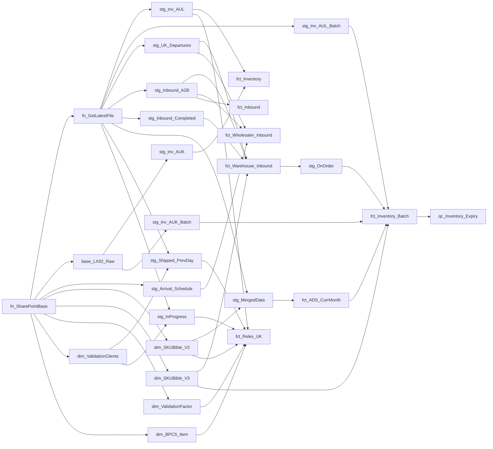

# AGENTS.md — AI Instruction Set for SupplyTrackerPowerQuery

> **Purpose**: System prompt for any AI agent tasked with modifying or extending the Unified Power Query codebase. Treat every rule here as a hard constraint.

---

## 1. Naming Conventions (Mandatory)

| Prefix | Purpose | Example | Extension |
|:---|:---|:---|:---|
| `fn_` | Shared helper functions | `fn_SharePointBase.pq` | `.pq` |
| `base_` | Buffered raw data sources | `base_LX02_Raw.pq` | `.pq` |
| `dim_` | Dimension / master data | `dim_SKUBible_V2.pq` | `.pq` |
| `stg_` | Staging (load → clean → type) | `stg_UK_Departures.pq` | `.pq` |
| `fct_` | Fact (joins, calcs, output) | `fct_Warehouse_Inbound.pq` | `.pq` |
| `qc_` | Quality-control / diagnostics | `qc_Inventory_Expiry.pq` | `.pq` |

**All new queries MUST use the appropriate prefix.** The prefix determines the query's role in the pipeline.

---

## 2. Constraint Rules

### Architecture

1. **Single SharePoint entry point**: All SharePoint access MUST go through `fn_SharePointBase.pq`. **Never** call `SharePoint.Contents()` or `SharePoint.Files()` directly.
2. **Shared file picker**: Use `fn_GetLatestFile(folder, startsWith, endsWith)`. **Never** inline the sort-by-date-modified pattern.
3. **All joins MUST be `JoinKind.LeftOuter`** unless explicitly documented. Changing join kind silently drops rows.
4. **Never use `Table.Buffer()` at the output position** of any query (the `in` expression). It hides per-row errors. Inline buffer only for specific join optimization (e.g., inside `Record.FromTable` lookups or before multiple filter passes).
5. **Legacy folders are read-only**: `Warehouse Tracker/` and `Wholesaler Tracker/` exist only for audit reference.

### M-Code Formatting

- Use `let ... in` structure with each step on its own line
- Comment each logical section with `// Section: Description`
- Use `Table.SelectColumns` for schema pruning before joins
- Use `try ... otherwise null` for defensive field access on potentially dirty data
- Use `MissingField.Ignore` on `Table.SelectColumns` and `Table.RenameColumns` when columns may not exist

---

## 3. Logic Fragility Warnings

> [!CAUTION]
> These areas contain subtle, high-stakes logic. Modifications require extreme care.

### A2B Reference Tokenization (`stg_Inbound_A2B.pq`, lines 10–45)

The `Your Reference` column from the A2B CSV contains the TO number embedded with inconsistent separators (spaces, `/`, NBSP `#(00A0)`, control chars). The current logic:
1. Normalizes all separators to space
2. Splits by space
3. Takes the **last token** as `Departure`

**Risk**: If the upstream A2B system changes its reference format, this fragile parsing will silently produce wrong Departure values.

### UK Departures Row Filtering (`stg_UK_Departures.pq`, line 20)

The Excel export includes summary rows ("Grand Total", "Total") that must be excluded. The filter checks `[ETD]` and `[DEPARTURE]` columns. If the upstream Excel format adds new summary labels, they won't be caught.

### Forwarder SLA Days (Hardcoded)

| Forwarder | Offset | File | Line |
|:---|:---|:---|:---|
| `NOUWENS` | `+1` day | `fct_Warehouse_Inbound.pq` | ~42 |
| `ESSERS` | `+5` days | `fct_Wholesaler_Inbound.pq` | ~36 |

These are contractual SLAs that **can change**. If forwarder contracts are renegotiated, these are the exact lines to update.

### Storage Type / Lock Code Mapping Chains

- `stg_Inv_AUK.pq` — 5 storage type codes
- `stg_Inv_AUK_Batch.pq` — 8+ storage type codes, 15+ storage bin mappings
- `stg_Inv_AUL_Batch.pq` — 7 lock codes, 7 storage bin mappings

New codes from upstream map to `"NEW STORAGE TYPE TO BE DECIDED"` or `"NEW LOCK CODE TO BE ADDED"`. These sentinel values will surface in reports.

### Months to Sell Formula (`fct_Inventory_Batch.pq`)

```
Months to Sell = (Days to Expiry - SHIP SHELF LIFE) / 30
```

This is **months of sellable shelf life**, NOT months of stock coverage (inventory ÷ demand). Do NOT confuse these.

### Weekend Shift (`fct_Relex_UK.pq`, line 149)

```
ShiftWeekendToMonday = true
```

When `true`, any delivery that falls on Saturday(5) or Sunday(6) is shifted to Monday(0). This changes order plan output.

---

## 4. Dependency Graph



### Text-Based Dependency List

| Query | Depends On |
|:---|:---|
| `fn_SharePointBase` | *(SharePoint site root)* |
| `fn_GetLatestFile` | *(standalone function)* |
| `base_LX02_Raw` | `fn_SharePointBase` |
| `dim_SKUBible_V2` | `fn_SharePointBase` |
| `dim_SKUBible_V3` | `fn_SharePointBase` |
| `dim_ValidationClients` | `fn_SharePointBase` |
| `dim_ValidationFactor` | `fn_SharePointBase` |
| `dim_BPCS_Item` | `fn_SharePointBase`, `fn_GetLatestFile` |
| `stg_Inv_AUK` | `base_LX02_Raw` |
| `stg_Inv_AUK_Batch` | `base_LX02_Raw` |
| `stg_Inv_AUL` | `fn_SharePointBase`, `fn_GetLatestFile` |
| `stg_Inv_AUL_Batch` | `fn_SharePointBase`, `fn_GetLatestFile` |
| `stg_UK_Departures` | `fn_SharePointBase`, `fn_GetLatestFile` |
| `stg_Inbound_A2B` | `fn_SharePointBase`, `fn_GetLatestFile` |
| `stg_Inbound_Completed` | `fn_SharePointBase`, `fn_GetLatestFile` |
| `stg_MergedData` | `fn_SharePointBase`, `fn_GetLatestFile`, `dim_SKUBible_V2` |
| `stg_Shipped_PrevDay` | `fn_SharePointBase`, `fn_GetLatestFile`, `dim_ValidationClients` |
| `stg_InProgress` | `fn_SharePointBase`, `fn_GetLatestFile`, `dim_ValidationClients` |
| `stg_Arrival_Schedule` | `fn_SharePointBase` |
| `stg_OnOrder` | `fct_Warehouse_Inbound` |
| `fct_Warehouse_Inbound` | `stg_UK_Departures`, `stg_Inbound_A2B`, `stg_Inbound_Completed`, `dim_SKUBible_V3` |
| `fct_Wholesaler_Inbound` | `stg_UK_Departures`, `stg_Inbound_A2B`, `stg_Arrival_Schedule` |
| `fct_Inventory` | `stg_Inv_AUK`, `stg_Inv_AUL` |
| `fct_Inventory_Batch` | `stg_Inv_AUK_Batch`, `stg_Inv_AUL_Batch`, `dim_SKUBible_V3`, `fct_ADS_CurrMonth`, `stg_OnOrder` |
| `fct_ADS_CurrMonth` | `stg_MergedData` |
| `fct_Inbound` | `stg_Inbound_A2B` |
| `fct_Relex_UK` | `dim_SKUBible_V2`, `dim_ValidationFactor`, `dim_BPCS_Item`, `dim_ValidationClients`, `stg_Shipped_PrevDay`, `stg_InProgress`, `stg_Inv_AUL` |
| `qc_Inventory_Expiry` | `fct_Inventory_Batch` |

---

## 5. Hardcoded Values Inventory (Technical Debt)

| Value | File | Line | Risk |
|:---|:---|:---|:---|
| `"075-UK"` | `stg_Inv_AUK.pq`, `stg_Inv_AUK_Batch.pq` | — | Warehouse code for AUK Queenborough |
| `"075-UL"` | `stg_Inv_AUL.pq`, `stg_Inv_AUL_Batch.pq` | — | Warehouse code for AUL third-party |
| `"UNITED KINGDOM"` | `dim_SKUBible_V2.pq`, `dim_SKUBible_V3.pq` | — | Affiliate filter |
| `"AAH"` | `stg_Shipped_PrevDay.pq`, `stg_InProgress.pq`, etc. | — | Hard-filter for AAH wholesaler |
| `"Master Arrival Schedule PBI.xlsx"` | `stg_Arrival_Schedule.pq` | 6 | Hardcoded filename (not using `fn_GetLatestFile`) |
| `"AAH Bible.xlsx"` | `dim_ValidationFactor.pq`, `dim_ValidationClients.pq` | 3 | Hardcoded filename |
| `"MasterMassiveNew.xlsb"` | `stg_MergedData.pq` | — | Hardcoded filename |
| `Encoding=1252` | `stg_Inbound_A2B.pq` | 6 | CSV encoding assumption (Windows-1252) |
| `/ 30` | `fct_Inventory_Batch.pq` | — | Days-to-months divisor (approximation) |
| `/ 14` | `fct_Relex_UK.pq` | — | Forecast daily = 14-day forecast ÷ 14 |
| `"Item Masters BPCS"` | `dim_BPCS_Item.pq` | 5 | File prefix for BPCS item master |

---

## 6. Critical Nuances Not Obvious from File Names

1. **`stg_OnOrder.pq`** is NOT a staging query from an external file — it derives from `fct_Warehouse_Inbound`, extracting "Current Week" and "Next Week" inbound statuses. It sits between fact and fact in the dependency chain.

2. **`fct_Inbound.pq`** is a 6-line thin view over `stg_Inbound_A2B`. It selects 5 columns. It exists as a separate query because downstream Excel reports reference it by name.

3. **`qc_Inventory_Expiry.pq`** uses `Table.Buffer()` at the input (not output) to avoid re-evaluating `fct_Inventory_Batch` across 3 separate `Table.SelectRows` passes. This is the correct use of buffer.

4. **`dim_ValidationFactor.pq`** provides AAH-to-Abbott pack-size conversion factors. It's consumed via `Record.FromTable` (not join) in `fct_Relex_UK` for performance.

5. **`stg_Arrival_Schedule.pq`** column names contain dots and brackets (e.g., `FACT_Shipment_Actuals[Invoice]`) — these come from the source Excel and are NOT Power Query record access syntax.

6. **`fct_Relex_UK.pq`** at 232 lines is the largest query. The `Table.FromRecords(Table.TransformRows(...))` pattern on line 98 strips all column types — the `ReTyped` step on line 119 restores them. Both must stay in sync.
