# SupplyTrackerPowerQuery

Power Query M-code repository for Abbott UK's daily supply chain tracking. Consolidates **Warehouse** and **Wholesaler** data into a single **Unified** query layer, refreshed manually in Excel Desktop.

---

## Folder Structure

```
├── Unified/                  ← PRODUCTION (Single Source of Truth)
│   ├── fn_*.pq               ← Shared helpers (SharePoint base, file picker)
│   ├── base_*.pq             ← Buffered raw sources (shared across queries)
│   ├── dim_*.pq              ← Dimension / master data queries
│   ├── stg_*.pq              ← Staging queries (load → clean → type)
│   ├── fct_*.pq              ← Fact queries (joins, calculations, output)
│   └── qc_*.pq               ← Quality-control / diagnostic queries
│
├── Warehouse Tracker/        ← LEGACY (archived, do not modify)
└── Wholesaler Tracker/       ← LEGACY (archived, do not modify)
```

> **Legacy folders exist only for reference.** All production work uses `Unified/`.

---

## Data Sources

All data is sourced from a single SharePoint site:

```
https://abbott.sharepoint.com/sites/GB-AN-HeadOffice
└── Shared Documents/General/Demand/
    ├── SKU Bible V2.xlsx              → dim_SKUBible_V2
    ├── SKU Bible V3.xlsx              → dim_SKUBible_V3
    ├── AAH Bible.xlsx                 → dim_ValidationClients, dim_ValidationFactor
    └── Master Data Files/
        ├── Daily Tracker Files/           → stg_Inv_AUK, stg_Inv_AUK_Batch,
        │                                    stg_Inv_AUL, stg_Inv_AUL_Batch,
        │                                    stg_Inbound_Completed, base_LX02_Raw
        ├── Daily Tracker Files - Wholesaler/ → fct_Relex_UK, stg_Shipped_PrevDay,
        │                                       stg_InProgress
        ├── Daily Tracker Files UK Departures PBI/ → stg_UK_Departures
        ├── Daily Tracker - Master Arrival Schedule/ → stg_Arrival_Schedule
        └── DMF New/                       → stg_MergedData (MasterMassiveNew.xlsb)
```

---

## Data Lineage

```mermaid
graph TD
    subgraph SharePoint Sources
        SP_LX02[LX02.xlsx]
        SP_UKDep[UK Departures.xlsx]
        SP_A2B[booking_overview.csv]
        SP_AUL_Batch[Inventory Batch.xls]
        SP_AUL_SKU[Inventory by SKU.xls]
        SP_Completed[Completed Bookings.xls]
        SP_Relex[Abbott Stock File.xlsx]
        SP_PrevDay[SHIPPED PREV DAY.xls]
        SP_InProg[LINES IN PROGRESS.xls]
        SP_MasterMassive[MasterMassiveNew.xlsb]
        SP_MasterArrival[Master Arrival Schedule PBI.xlsx]
        SP_SKUV2[SKU Bible V2.xlsx]
        SP_SKUV3[SKU Bible V3.xlsx]
        SP_AAH[AAH Bible.xlsx]
        SP_BPCS[BPCS Item Master]
    end

    subgraph Shared Helpers
        fn_SP[fn_SharePointBase]
        fn_GLF[fn_GetLatestFile]
        base_LX02[base_LX02_Raw]
    end

    subgraph Dimensions
        dim_V2[dim_SKUBible_V2]
        dim_V3[dim_SKUBible_V3]
        dim_VC[dim_ValidationClients]
        dim_VF[dim_ValidationFactor]
        dim_BPCS[dim_BPCS_Item]
    end

    subgraph Staging
        stg_AUK[stg_Inv_AUK]
        stg_AUK_B[stg_Inv_AUK_Batch]
        stg_AUL[stg_Inv_AUL]
        stg_AUL_B[stg_Inv_AUL_Batch]
        stg_UKDep[stg_UK_Departures]
        stg_A2B[stg_Inbound_A2B]
        stg_Comp[stg_Inbound_Completed]
        stg_Merged[stg_MergedData]
        stg_OnOrd[stg_OnOrder]
        stg_Prev[stg_Shipped_PrevDay]
        stg_InPrg[stg_InProgress]
        stg_Arrival[stg_Arrival_Schedule]
    end

    subgraph Facts
        fct_WH[fct_Warehouse_Inbound]
        fct_WS[fct_Wholesaler_Inbound]
        fct_Inv[fct_Inventory]
        fct_InvB[fct_Inventory_Batch]
        fct_ADS[fct_ADS_CurrMonth]
        fct_Relex[fct_Relex_UK]
        fct_Inb[fct_Inbound]
    end

    subgraph QC
        qc_Exp[qc_Inventory_Expiry]
    end

    SP_LX02 --> base_LX02 --> stg_AUK & stg_AUK_B
    SP_UKDep --> stg_UKDep --> fct_WH & fct_WS
    SP_A2B --> stg_A2B --> fct_WH & fct_WS & fct_Inb
    SP_AUL_Batch --> stg_AUL_B
    SP_AUL_SKU --> stg_AUL
    SP_Completed --> stg_Comp
    SP_Relex --> fct_Relex
    SP_PrevDay --> stg_Prev --> fct_Relex
    SP_InProg --> stg_InPrg --> fct_Relex
    SP_MasterMassive --> stg_Merged --> fct_ADS
    SP_MasterArrival --> stg_Arrival --> fct_WS
    SP_SKUV2 --> dim_V2
    SP_SKUV3 --> dim_V3
    SP_AAH --> dim_VC & dim_VF
    SP_BPCS --> dim_BPCS

    stg_AUK & stg_AUL --> fct_Inv
    stg_AUK_B & stg_AUL_B --> fct_InvB
    dim_V3 --> fct_InvB & fct_WH
    fct_ADS --> fct_InvB
    fct_WH --> stg_OnOrd --> fct_InvB
    fct_InvB --> qc_Exp
    dim_V2 --> stg_Merged & fct_Relex
    dim_VF & dim_BPCS & dim_VC --> fct_Relex
    stg_AUL --> fct_Relex
```



---

## Key Business Logic

### Product Identifiers

| Identifier | Source | Scope | Notes |
|:---|:---|:---|:---|
| `LOCAL ITEM NBR` | SKU Bible V2 | **Canonical** business ID | Finest grain — one per product variant |
| `1-6-3-3` | SKU Bible V2 | Product group | Multiple `LOCAL ITEM NBR` per `1-6-3-3` |
| `SHORT 1633` | SKU Bible V2 | Compact `1-6-3-3` | Used as join key to BPCS |
| `ECC CODE` | SKU Bible V3 | SAP material number | Used in inventory + inbound joins |
| `Product Code` | Warehouse files | Warehouse system ID | Equivalent to `ECC CODE` in practice |

### SKU Bible Versions

- **V2** (`SKU Bible V2.xlsx`): Product-level master. No plant split. Used by `stg_MergedData`, `fct_Relex_UK`.
- **V3** (`SKU Bible V3.xlsx`): Plant-level master (has `PLANT CODE`). Contains `SHIP SHELF LIFE` per plant. Used by `fct_Inventory_Batch`, `fct_Warehouse_Inbound`.

### Warehouses

| Code | Location | Source System |
|:---|:---|:---|
| `075-UK` | AUK (Queenborough) | LX02 (SAP WM) |
| `075-UL` | AUL (third-party) | Inventory Batch / Inventory by SKU |

### Forwarder SLAs (Contractual — subject to change)

| Forwarder | Rule | Used In |
|:---|:---|:---|
| `NOUWENS` | Expected Delivery = ETD + 1 day | `fct_Warehouse_Inbound` |
| `ESSERS` | Expected Delivery = ETD + 5 days | `fct_Wholesaler_Inbound` |
| `A2B` | Expected Delivery = A2B file date | `fct_Wholesaler_Inbound` |

### Months to Sell

```
Months to Sell = (Days to Expiry - SHIP SHELF LIFE) / 30
```

Gives the number of months of **sellable shelf life** remaining. This is distinct from "months of stock coverage" (inventory ÷ demand).

### Weekend Shipping

Orders whose lead-time delivery falls on Saturday/Sunday are shifted to **Monday**. This is a **configurable preference** in `fct_Relex_UK` (`ShiftWeekendToMonday = true`).

---

## Refresh

- **Environment**: Power Query in Excel Desktop (manual refresh)
- **Dependency resolution**: Automatic via Power Query's internal dependency graph
- **No gateway or scheduled refresh** is configured

---

## Wholesaler Scope

Currently **AAH (Alliance Healthcare)** is the only wholesaler. All Wholesaler queries hard-filter for `"AAH"`. If additional wholesalers are onboarded, each will require its own pipeline.
